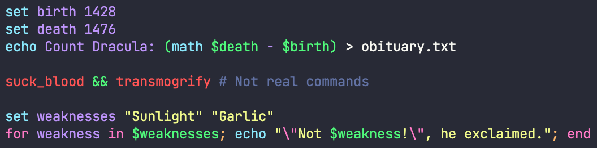

# Dracula for [Fish](http://fishshell.com)

> A dark theme for [friendly interactive shell (fish)](http://fishshell.com)

## Install

All instructions can be found at [draculatheme.com/fish](https://draculatheme.com/fish).

## Team

This theme is maintained by the following person(s) and a bunch of [awesome contributors](https://github.com/dracula/fish/graphs/contributors).

 |  |  |
--- | --- | --- |
[Daniel Mita](https://github.com/mienaikage) | [Trollwut](https://github.com/Trollwut) | [Jamin Thornsberry](https://github.com/jaminthorns) |

## License

[MIT License](./LICENSE)
